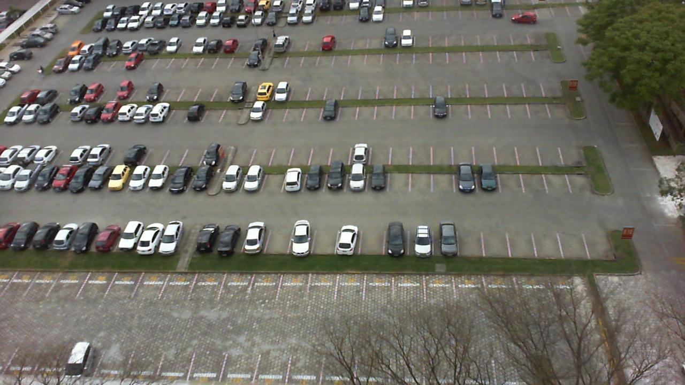
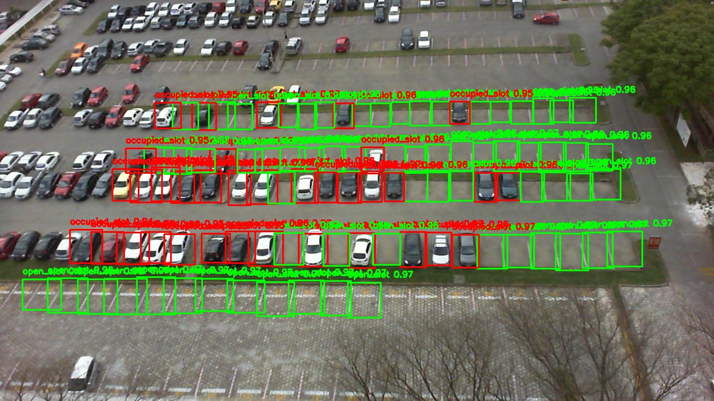
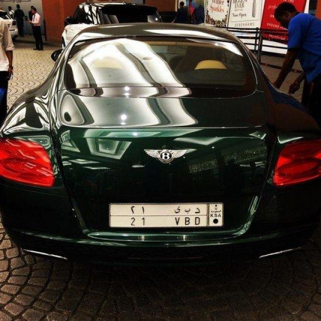
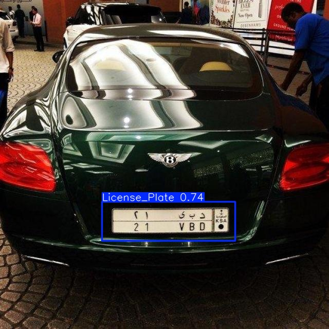
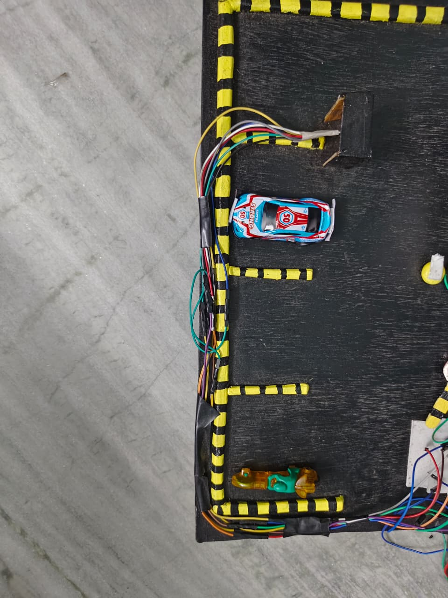
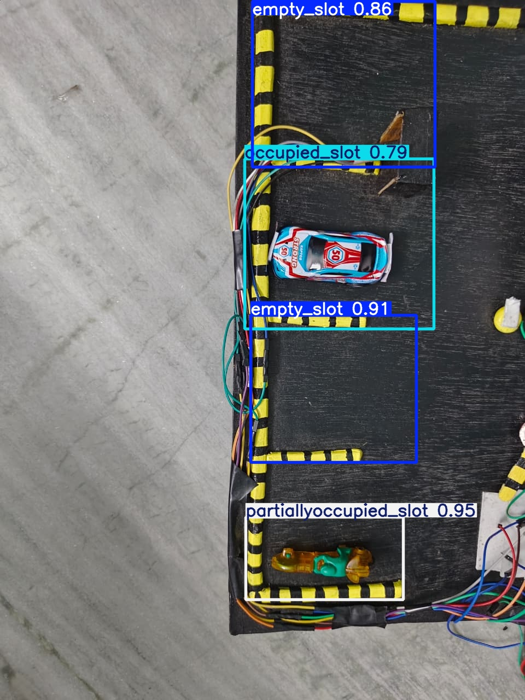

# 🚗 Dynamic Smart Parking System

An AI-powered Smart Parking System that integrates:

- Parking Slot Detection using YOLOv8
- Number Plate Detection using YOLOv8
- Dynamic Parking Slot Detection
- Real-time Parking Space Utilization

The system aims to improve parking efficiency by identifying:

✅ Empty Slots  
✅ Occupied Slots  
✅ Partially Occupied Slots  
✅ Vehicle Number Plates  

---

# 🅿️ 1. Parking Slot Detection

Detects parking spaces as:

- Open Slot
- Occupied Slot

### Input Image



### Detection Output



---

# 🔢 2. Number Plate Detection

Detects vehicle number plates using YOLOv8.

### Input Image



### Detection Output



---

# 🚲 3. Dynamic Parking Detection

This module identifies:

- Empty Slot
- Occupied Slot
- Partially Occupied Slot

The idea is to maximize parking utilization.

For example:

If a car-sized slot contains one bike, the remaining area can still accommodate another bike.

### Input Image



### Detection Output



---

# 🛠️ Technologies Used

- Python
- YOLOv8
- OpenCV
- PyTorch
- CUDA
- Roboflow
- EasyOCR

---

# 📁 Project Structure

```text
Dynamic-Smart-Parking-System

├── slot_detection
│   ├── train.py
│   ├── test.py
│   ├── data.yaml
│   └── output images

├── number_plate_detection
│   ├── train.py
│   ├── test.py
│   ├── validate.py
│   └── output images

├── dynamic_parking_detection
│   ├── train.py
│   ├── test.py
│   ├── data.yaml
│   └── output images

├── README.md
└── .gitignore
```

---

# 🚀 Future Work

- Parking Occupancy Prediction using LSTM
- Dynamic Parking Recommendation System
- Real-time Mobile Application
- Smart Reservation System
- EV Charging Slot Detection
- Traffic-aware Parking Guidance

---

## 👩‍💻 Author

**Aditi Sharma**

B.Tech Information Technology

AI/ML & Computer Vision Enthusiast